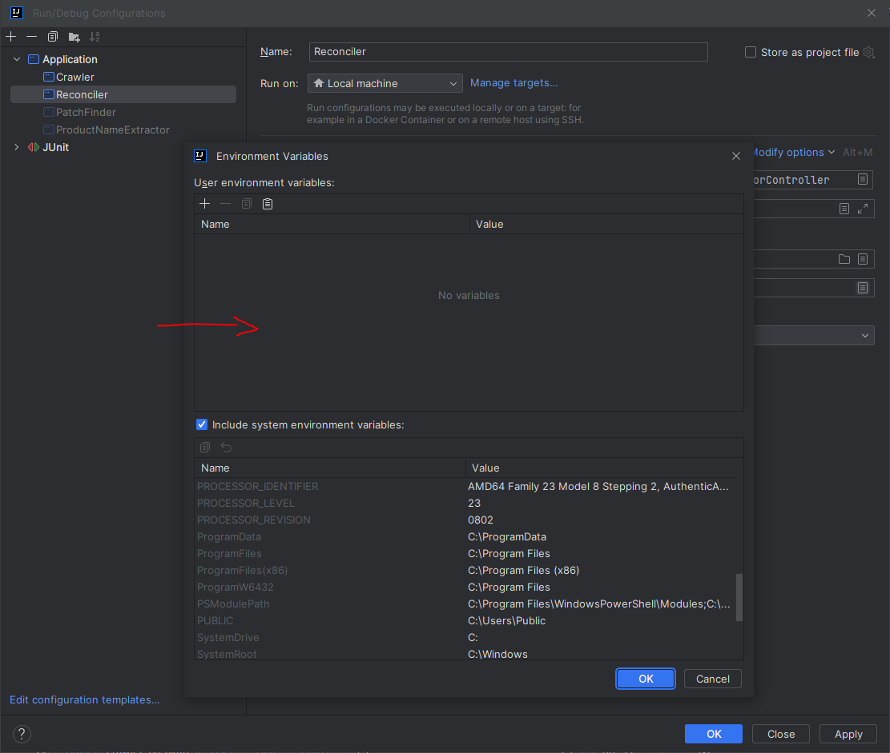

# NVIP Crawler Backend - Product Name Extractor

The product name extractor component of NVIP Crawler identifies affected products in a CVE via a Named Entity Recognition (NER) model.
- The model and its training data is provided in the resources directory
- Each extracted product is converted as a Common Product Enumeration (CPE) string
- CPE Definition and Dictionary(s): https://nvd.nist.gov/products/cpe

> **NOTE:** This component relies directly on the vulnerability data from the crawler and should be ran after vulnerability data is populated in the db

## System Requirements

* Product Name Extractor requires at least Java version 8.
    - Download Link: https://www.oracle.com/java/technologies/javase/javase8-archive-downloads.html

* Product Name Extractor uses MySQL (version 8) to store CVEs. The database must be created before running the system. The current database dump is provided at '../nvip_data/mysql-database'.
    - Download Link: https://dev.mysql.com/downloads/installer/

* We're also going to be using Liquibase for updating and tracking changes to the database schema.
    - Download Link: https://www.liquibase.com/download

* Java Maven is used to compile the project with its requirements.
    - Download Link: https://maven.apache.org/download.cgi

* We also use Docker for building and deploying the project, however it is not necessary for debugging and development builds.
    - Download Link: https://docs.docker.com/engine/install/

* Because the crawling process is a multi-threaded process and the characterization and product name extraction trains AI/ML models, minimum 8GB RAM is needed to run the system.

## Summary of Open Source Technologies/Systems Used

* MySQL database is used to store crawled and characterized CVEs and products affected by said CVEs: https://www.mysql.com/

* NVIP also uses Log4j for logging errors and state: https://logging.apache.org/log4j/2.x/javadoc.html

* The DeepLearning4j framework is used to train Deep Learning (LSTM) models for product name extraction: https://deeplearning4j.org/

# Installation and Setup Guide

## 1. Download & Install MySQL, Create the Database

* Download “mysql-installer-community-8.0.20.0.msi” from  https://dev.mysql.com/downloads/installer/.

* Click on the downloaded file, choose “Full” installation and continue with default options.

* During the configuration of MySQL Server, when prompted for a password (for user "root"), make sure you use the "same password" that you have at the **HIKARI_PASSWORD** Environment Variable.

## 2. Create Database (via MySQL Workbench)

* After the setup process is finished open "MySQL Workbench" program (Click start and search for "MySQL Workbench" to find it).

* Click on "Database/Connect To Database" menu on MySQL Workbench and Click "Ok". Enter the password you set for user "root" earlier. You should be connected to the MySQL database.

* Open a new query editor in MySQL Workbench and execute the script provided at '\nvip_data\mysql-database\CreateAndInitializeDb.sql' to create and initialize the MySQL database.
> Please make sure the MySQL username and password parameters in the
> environment variables are updated! (Refer to **Environment Variables** section for specific DB parameters needed)

## 3. Build & Package

From the root directory, run the following command via cmd line to install dependencies:

    $ mvn clean install

If successful, run the following command to package the Maven project into a jar file

    $ mvn package -DskipTests`

You can also run unit tests separately with the Maven test command:

    $ mvn test

After the build process, the output jar will be located under the "target" directory of the project root.

**If you are not using Docker**, you don't have to worry about the jar file as long as it builds successfully. Otherwise, this is the Jar file that Docker will use to run the application.

## 4. Create a Configuration to run the Product Name Extractor (IntelliJ)

> **NOTE:** Intellij does not read env.list files automatically, the contents of the patch finder env.list file can be copied directly into the menu shown in the image below. See **Environment Variables** for more information. 
> 
> 

## 4. Install Docker and Build via Docker CLI

#### Build Crawler Image
    $ docker build -t crawler .

#### Run with Env List
    $ docker run -* **m**: Placeholder
	- Default value:10g
 --env-file env.list crawler

Where `-m` is the maximum memory (RAM) the container can use during runtime, and `--env-file` is the path to
the environment variable file (in `.list` format)

Make sure your MySQL service is running. If not, try the following:

- (Windows) Go to services panel via windows explorer, navigate to where your MySQL service is (named MySQL80), select
  the service and click "start".

- You can verify the service running by logging into MySQL via MySQL Command Line or MySQL Workbench
  (Login will automatically fail if the service isn't running, so be sure the login credentials are correct!)

- Make sure the **NVIP_DATA_DIR** points to the resources directory and the database user and password in the **Environment Variables** are correct.

### Installation & Configuration Checklist
- All parameters are located in **Environment Variables**

- Required training data and resources are stored under the `src/main/resources` folder (the data directory).
  You need to configure the data directory of the project (in the **Environment Variables** and (maybe) `nvip.properties`)
  to point to this directory.

### Environment Variables

The `env.list` file contains a set of environment variables that the crawler requires in order to run.
Some variables contain default values for if they're not specified, but it is advised to have them configured based on your usage.

Like stated previously, you can provide these variables when running the application with Docker via the `env.list` file.
If you want to run it locally without Docker, you'll need to provide the environment variables through whatever tool or IDE you're using.

- Setting up environment variables w/ **IntelliJ**: https://www.jetbrains.com/help/objc/add-environment-variables-and-program-arguments.html

- Setting up environment variables w/ **VS Code**: https://code.visualstudio.com/remote/advancedcontainers/environment-variables

**NOTE** If you're running the application with Docker, you will not need to worry about setting up the Env Vars via your IDE.
IF there's any change in your Env Vars, you don't need to rebuild the image (unless there's changes in the code or properties files).

A list of the environment variables is provided below:

#### Database

* **HIKARI_URL**: JDBC URL used for connecting to the MySQL Database.
    - There is no default value.
    - Use mysql://localhost:3306 for running locally, and mysql://host.docker.internal:3306 to run with docker

* **HIKARI_USER**: Database username used to login to the MySQL database
    - There is no default value

* **HIKARI_PASSWORD**: Database password used to login to the MySQL database
    - There is no default value

#### Runtime Data

* **NVIP_DATA_DIR**: Directory path for data resources used by NVIP at runtime
    - Default value: src/main/resources

* **NVIP_OUTPUT_DIR**: Output directory path for the web crawler(s)
    - Default value: output/crawlers

#### Product Name Extractor

* **CHAR_2_VEC_CONFIG**: Path to the char2vec config file
	- Default value:c2v_model_config_50.json

* **CHAR_2_VEC_WEIGHTS**: Path to the char2vec weights file
	- Default value:c2v_model_weights_50.h5

* **WORD_2_VEC**: Path to the word2vec model file
	- Default value:w2v_model_250.bin

* **NER_MODEL**: Path to the NER model file
	- Default value:NERallModel.bin

* **NER_MODEL_NORMALIZER**: Path to the NER model normalizer file
	- Default value:NERallNorm.bin

* **CVE_LIMIT**: Limit of CVEs to process
	- Default value:1000

* **MAX_PAGES**: Limit of pages of CPEs to query from NVD
	- Default value:5

* **MAX_ATTEMPTS_PER_PAGE**: Max attempts at getting CPEs per page before a page is skipped
	- Default value:2

* **PRODUCT_DICT_PATH**: Path to the saved CPE product dictionary file
	- Default value:src/main/resources/data/product_dict.json

